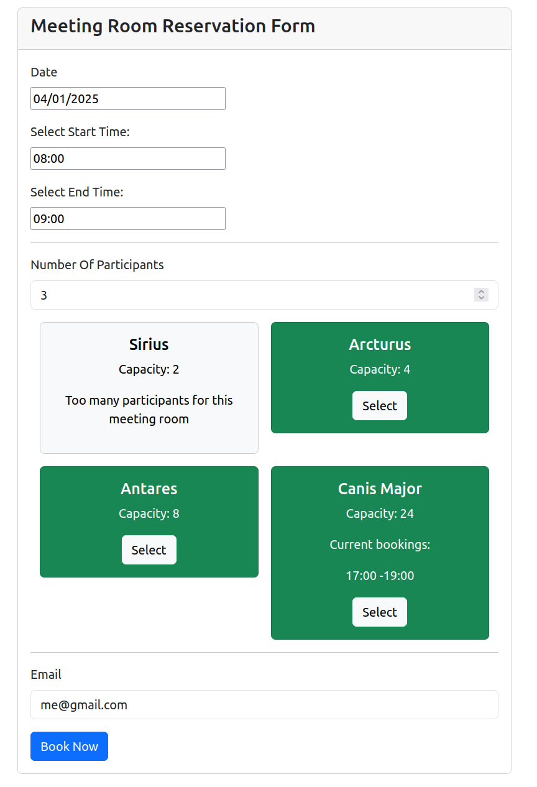

# Booking demo

## Installation

1. `git clone https://github.com/RobinBrackez/booking-demo.git`
2. go to the project root with `cd ./booking-demo`
2. go to the react folder with `cd ./react-frontend` and run `npm install`
3. go to the project root with  `cd ..` and run `docker compose up`

Docker automatically runs migrations and installs demo data.

If you run into trouble with the docker boxes, or you use your custom boxes, you should execute these commands in the symfony docker container:
````
# only execute this if the regular installation procedure doesn't work
composer install
./bin/console doctrine:migrations:migrate
./bin/console app:install --meeting-rooms --bookings
````

## Configuration

* set database password in inside the project root `.env` file
* configure allowed booking hours inside `symfony-backend/config/services.yaml`
  * `booking.allowed_start_date` and `booking.allowed_end_date`

## Run

After running `docker compose up`, you can see the demo at:

Api: http://0.0.0.0:8000/api

Application: http://localhost:3000

For further development, copy the pre-commit-hooks to automatically apply php-cs-fixer:
````
cp pre-commit .git/hooks/pre-commit
````

## Tests

````
cp ./phpunit.xml.dist ./phpunit.xml
./bin/phpunit
````

## Thoughts / Todo's:

* **Security**: website has no authentication system, so everyone can register a room in someone else's name.
* **Security**: api has no authentication system, anyone can fire requests.

## Screenshot

